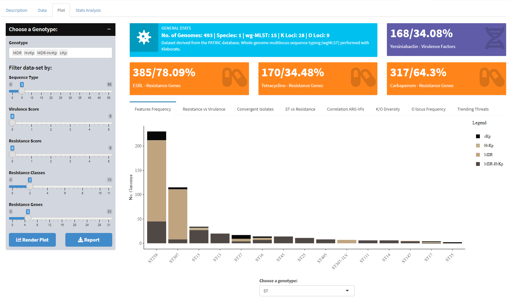

# MDR-hvKp
The spread of antimicrobial-resistant bacteria globally is a pressing issue that has captured my attention.

- It's concerning to see how certain bacteria are becoming resistant to the drugs we use to treat them, leading to the rise of superbugs that are difficult to control.

- In 2017, WHO Priority Pathogens: A list of antibiotic-resistant bacteria assessed to be of highest priority for new antibiotic development.

- In 2019, nearly 1.3 million deaths including 140 thousand newborns were caused by AMR. This is expected to rise to 10 million deaths by 2050.

- We can develop strategies to prevent antimicrobial spread and improve patient outcomes by understanding the patterns and drivers of antimicrobial resistance.

## R package requirements:
- R 4.1.0
- shiny 1.6.0
- shinydashboard 0.7.2
- DT 0.19
- dplyr 1.0.7
- ggplot2 3.3.5
- plotly 4.9.4.1
- heatmaply 1.5.0
- paletteer 1.5.0
- gtsummary 1.7.2
- rmarkdown 2.25
- renv 1.0.3

## Features:
This web-based application has been developed to facilitate the exploration of genomic diversity and population structure analysis of multi-drug resistant hypervirulent Klebsiella pneumoniae (MDR-hvkp).

The application is designed to provide a user-friendly interface for researchers and clinicians to analyze and visualize the genomic data of MDR-hvkp strains.

It offers a range of tools and features to help users identify genetic variations, track the pathogen's spread, and understand the population structure of MDR-hvkp.

# Authors
Julio Cesar - 2023, Beijing
